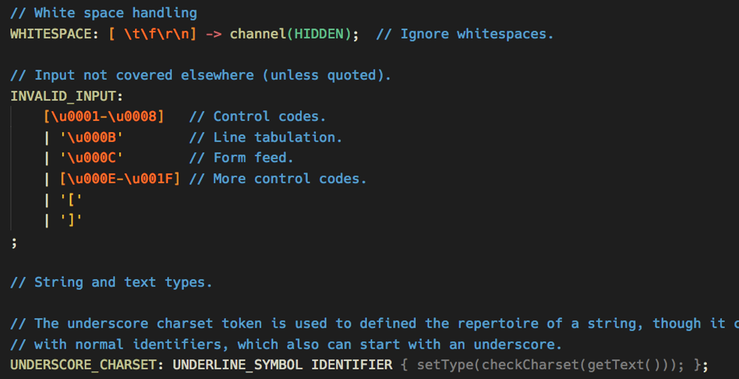
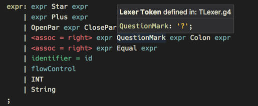
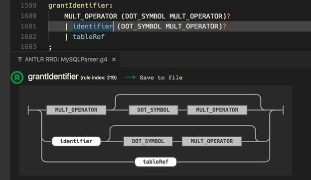

[](https://marketplace.visualstudio.com/items?itemName=mike-lischke.vscode-antlr4)
[](https://marketplace.visualstudio.com/items?itemName=mike-lischke.vscode-antlr4)
[](https://marketplace.visualstudio.com/items?itemName=mike-lischke.vscode-antlr4)

<p align="right">
  
</p>


# vscode-antlr4
**The** extension for ANTLR4 support in Visual Studio code.

## Features

### Syntax Coloring

* Complete syntax coloring for ANTLR grammars (.g and .g4 files).
>
    
* Comes with an own beautiful color theme, which not only includes all the [recommended groups](http://manual.macromates.com/en/language_grammars), but also some special rules for grammar elements that you don't find in other themes.

### Code Completion + Symbol Information

* Code suggestions for all rule + token names, channels, modes etc. (including built-in ones).

* Symbol type + location are shown on mouse hover. Navigate to any symbol with Ctrl/Cmd + Click. This works even for nested grammars (token vocabulary + imports).
>

* Symbol list for quick navigation (via Shift + Ctrl/Cmd + O).
>

### Grammar Validations

* In the background syntax checking takes place, while typing. Also some semantic checks are done, e.g. for duplicate or unknown symbols.
>

* When parser generation is enabled (at least for internal use) ANTLR4 itself is used to check for errors and warnings. These are then reported instead of the internally found problems and give you so the full validation power of ANTLR4.
>

### Parser Generation

* When enabled the extension creates parser and lexer files on each save of your grammar. This can used for internal operations only (e.g. to find detailed error information or to generate railroad diagrams) or to generate these files for you. Furthermore, interpreter data is generated which is used to generate the ATN graphs. This generation process can be finetuned by various settings (see below).

### Graphical Visualizations

* There is a function to generate railroad diagrams for all types of rules (parser, lexer, fragment lexer), provided by the [railroad-diagrams script from Tab Atkins Jr.](http://github.com/tabatkins/railroad-diagrams). You can either do that for the rule under the caret (and the display changes as you move the caret) or for the entire grammar file. An export function allows to generate an SVG file of the graph on disk. Colors + fonts can be adjusted by using custom CSS file(s). See also the available options below.
>

* Another cool feature are ATN graphs for all rule types. This is a visualization of the internal ATN that drives lexers + parsers. It uses D3.js for layout and interaction. Nodes can be repositioned with the mouse and you can drag and zoom the image. The transformation and position state is restored when reopening a graph. Also here you can customize the display with own CSS and save the image to disk.
>

### Formatting

The extension is able to format grammar source code, considering a large set of options (see below). The [clang-format](http://clang.llvm.org/docs/ClangFormatStyleOptions.html) tool acted as a model for option naming and some settings that have been taken over. Other options are specific to grammar files. Beside the usual things like block formatting, colon and semicolon placement etc. there's a powerful alignment implementation. It allows to align certain grammar elements (trailing comments, lexer commands, alt labels, predicates and others) between consecutive lines that contain this grammar element (when grouped alignment is on) or for the entire file. There can even be multiple alignments on a line:

>

The formatting feature can be controlled by special comments, which allow to switch a setting on the fly (e.g. columnWidth). You can even completely switch off formatting for file or a part of it. Below are some examples for such a formatting comment. You can use boolean values (on, off, true, false), numbers and identifiers (for word options). They are not case-sensitive.

```
// $antlr-format on
// $antlr-format false
// $antlr-format columnLimit 150
// $antlr-format allowShortBlocksOnASingleLine true, indentWidth 8
```

Don't put anything else in a comment with formatting settings. All comment types are allowed but single line comments are read line by line and hence require each line to start with the `$antlr-format` introducer.

In order to set all settings to their default values use: `// $antlr-format reset`. This can also be used in conjunction with other options.

### Miscellaneous

* There is an option to switch on rule reference counts via Code Lens. This feature is switchable independent of the vscode Code Lens setting.

>

## Extension Settings

* **antlr4.referencesCodeLens.enabled**, boolean (default: false), if true enables the reference count display via Code Lens
* **antlr4.rrd.customcss**, array of string (default: empty array), list of custom css URIs for railroad diagrams
* **antlr4.rrd.saveDir**, string (default: empty/undefined), default export target folder for railroad diagrams
* **antlr4.atn.customcss**, array of string (default: empty array), list of custom css URIs for ATN graphs
* **antlr4.atn.saveDir**, string (default: empty/undefined), default export target folder for railroad diagrams
* **antlr4.atn.maxLabelCount**, number (default: 3), max number of labels displayed on a transition in an ATN graph
* **antlr4.generation.mode**, string enum (default: "internal"), determines what code generation pattern should be followed:
    * **none**: don't generate any code, not even for internal use
    * **internal**: allow code generation for internal use (e.g. for full error detection and interpreter data)
    * **external**: generate code also for external use, depending on the other generation options
* **antlr4.generation.outputDir**, string (default: empty/undefined), determines the output folder where to place generated code (used only if **antlr4.generation.mode** is set to "external")
* **antlr4.generation.importDir**, string (default: empty/undefined), location to import grammars from (relative to the grammar that is being saved, or absolute path), used also for internal code generation
* **antlr4.generation.package**, string (default: empty/undefined), package/namespace for generated code (used only in external mode)
* **antlr4.generation.language**, string (default: "Java"), specifies the target language for the generated code, overriding what is specified in the grammar (used only in external mode)
* **antlr4.generation.listeners**, boolean (default: true), also create listeners on code generation (used only in external mode)
* **antlr4.generation.visitors**, boolean (default: false), also create visitors on code generation (used only in external mode)

Options for grammar text formatting. Some names, values and meanings have been taken from [clang-format](http://clang.llvm.org/docs/ClangFormatStyleOptions.html). See there for a description if there's nothing below for a specific setting.

* **antlr4.format.alignTrailingComments**, boolean (default: false)
* **antlr4.format.allowShortBlocksOnASingleLine**, boolean (default: true)
* **antlr4.format.breakBeforeBraces**, boolean (default: false), when true start predicates and actions on a new line
* **antlr4.format.columnLimit**, number (default: 100)
* **antlr4.format.continuationIndentWidth**, number (default: same as indentWidth), for line continuation (only used if useTab is false)
* **antlr4.format.indentWidth**, number (default: 4)
* **antlr4.format.keepEmptyLinesAtTheStartOfBlocks**, boolean (default: false)
* **antlr4.format.maxEmptyLinesToKeep**, number (default: 1)
* **antlr4.format.reflowComments**, boolean (default: true)
* **antlr4.format.spaceBeforeAssignmentOperators**, boolean (default: true)
* **antlr4.format.tabWidth**, number (default: 4)
* **antlr4.format.useTab**, boolean (default: true)

Formatting options not found in clang-format:

* **antlr4.format.alignColons**, string (default: "none")
    * **none**, place the colon directly after the rule name
    * **trailing**, align colons in the alignment group
    * **hanging**, line break before colon and indented (aligning it so with the alt pipe chars)
* **antlr4.format.singleLineOverrulesHangingColon**, boolean (default: true), when `allowShortRulesOnASingleLine` is true and `alignColon` is set to "hanging" this setting determines which of the two gets precedence. If true a rule is placed on a single line if it fits, ignoring the "hanging" setting.
* **antlr4.format.allowShortRulesOnASingleLine**, boolean (default: true), like allowShortBlocksOnASingleLine, but for entire rules
* **antlr4.format.alignSemicolons**, string (default: "ownLine), determines the placement of semicolons in rules (not in options, import or gramar statements etc.)
    * **none**, no alignment, just put it at the end of the rule directly after the last token
    * **ownLine**, put it on an own line (not indented), unless allowShortRulesOnASingleLine kicks in
    * **hanging**, put it on an own line with indentation (aligning it so to the alt pipe chars)
* **antlr4.format.breakBeforeParens**, boolean (default: false), for blocks: if true puts opening parentheses on an own line
* **antlr4.format.ruleInternalsOnSingleLine**, boolean (default: false), place rule internals (return value, local variables, @init, @after) all on a single line, if true
* **antlr4.format.minEmptyLines**, number (default: 0), between top level elements, how many empty lines must exist
* **antlr4.format.groupedAlignments**, boolean (default: true), when true alignments are organized in groups of consecutive lines where they apply.
* **antlr4.format.alignFirstTokens**, boolean (default: false), when true align the first tokens after the colon
* **antlr4.format.alignLexerCommands**, boolean (default: false), when true align arrows from lexer commands
* **antlr4.format.alignActions**, boolean (default: false), when true align actions ({} blocks in rules) and predicates
* **antlr4.format.alignLabels**, boolean (default: true), when true align alt labels (# name), unless the block with the alts (and their lables) are formatted as single line block
* **antlr4.format.alignTrailers**, boolean (default: false), when true all the align* settings are ignored and instead all alignments are applied as if they were of the same type (avoids large whitespace runs if you have a mix of these types)

## Known Issues

None

## What's next?

* Show reference list for a symobl
* Refactoring (rename symbols, remove left recursion etc.)
* Live grammar interpreter for grammar preview
    * Specify test input (file or a string) + a start rule
    * Token list
    * Parse tree display
    * Call stack

## Release Notes

For details see [Git commit history](https://github.com/mike-lischke/vscode-antlr4/commits/master).
